# AlmaLinux 9 Sudo Configuration Labs

## Overview
This repository contains hands-on labs demonstrating advanced Linux system administration skills on AlmaLinux 9. The labs focus on managing sudo privileges and configuring sudo behavior, showcasing practical knowledge of user access control and system security.

## Prerequisites
- AlmaLinux 9 virtual machine
- Root access or sudo privileges for initial setup
- Basic familiarity with Linux command line

## Lab 1: Assigning Limited Sudo Privileges

### Objective
Create user accounts and assign different levels of sudo privileges to demonstrate granular access control.

### Steps

1. **Create User Accounts:**
   Create three user accounts with passwords:
   ```
   sudo useradd lionel
   sudo passwd lionel

   sudo useradd katelyn
   sudo passwd katelyn

   sudo useradd maggie
   sudo passwd maggie
   ```

   Switch to each account to verify creation:
   

2. **Edit the Sudoers File:**
   Open the sudoers file with visudo for safe editing:
   ```
   sudo visudo
   ```
   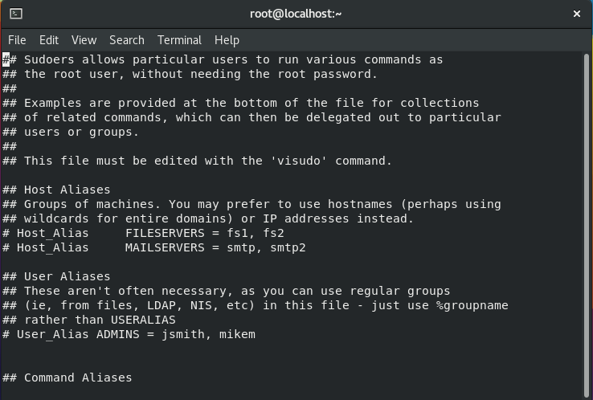

3. **Enable STORAGE Command Alias:**
   - Locate the STORAGE alias in the file.
   - Uncomment the line by removing the `#` symbol.
   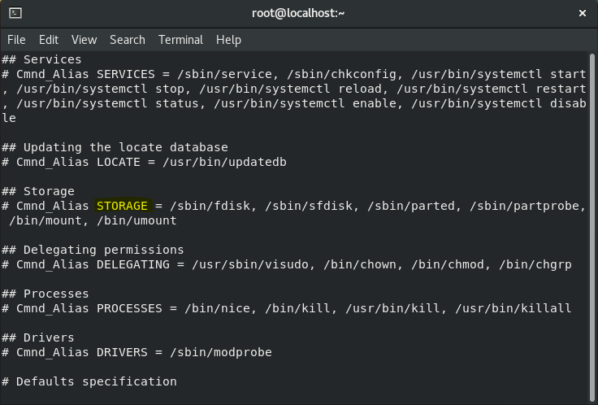

4. **Add User Privilege Rules:**
   Append the following rules at the end of the sudoers file:
   ```
   lionel ALL=(ALL) ALL
   katelyn ALL=(ALL) /usr/bin/systemctl status sshd
   maggie ALL=(ALL) STORAGE
   ```
   

   Save the file and exit.

5. **Verify Lionel's Privileges:**
   Switch to Lionel's account and test commands:
   ```
   su - lionel
   sudo su
   exit
   sudo systemctl status sshd
   ```
   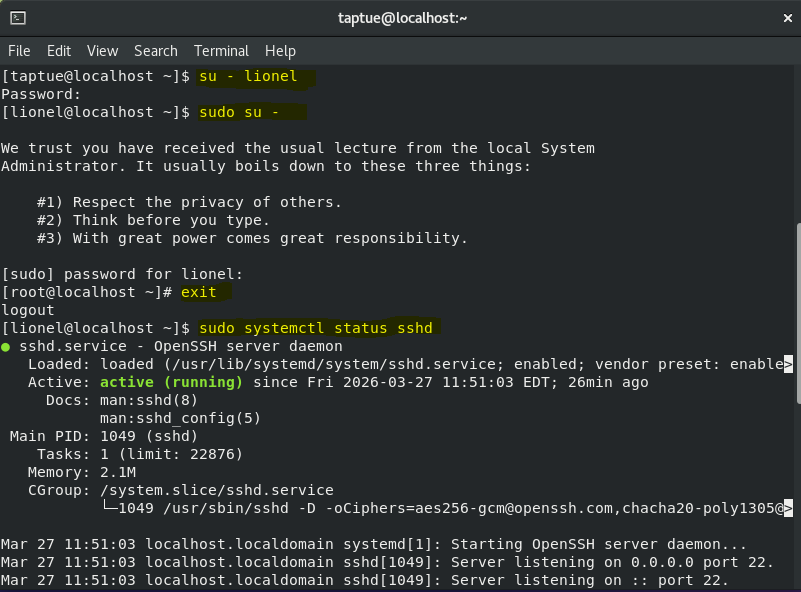

   ```
   sudo fdisk -l
   exit
   ```
   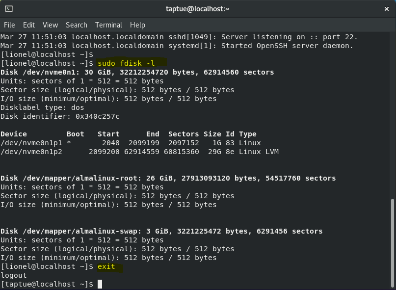

6. **Verify Katelyn's Privileges:**
   Switch to Katelyn's account and test commands:
   ```
   su - katelyn
   sudo su
   ```
   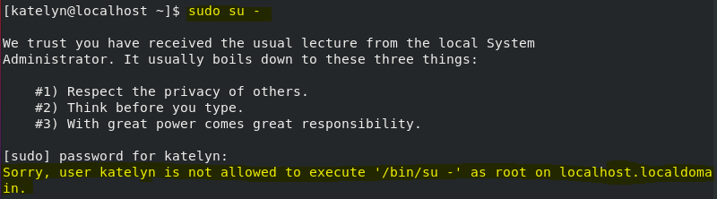

   ```
   sudo systemctl status sshd
   ```
   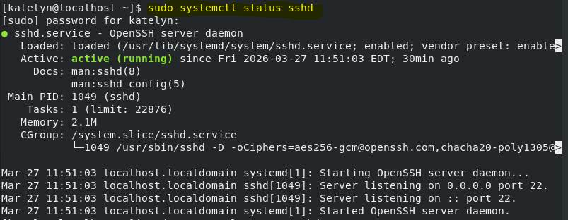

   ```
   sudo systemctl restart sshd
   ```
   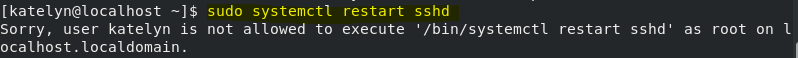

   ```
   sudo fdisk -l
   ```
   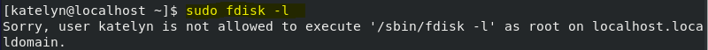

   ```
   exit
   ```

7. **Verify Maggie's Privileges:**
   Switch to Maggie's account and test commands:
   ```
   su - maggie
   sudo su
   ```
   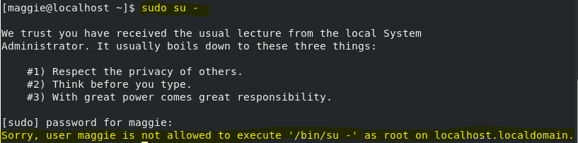

   ```
   sudo systemctl status sshd
   ```
   

   ```
   sudo systemctl restart sshd
   ```
   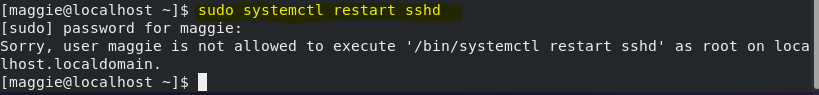

   ```
   sudo fdisk -l
   ```
   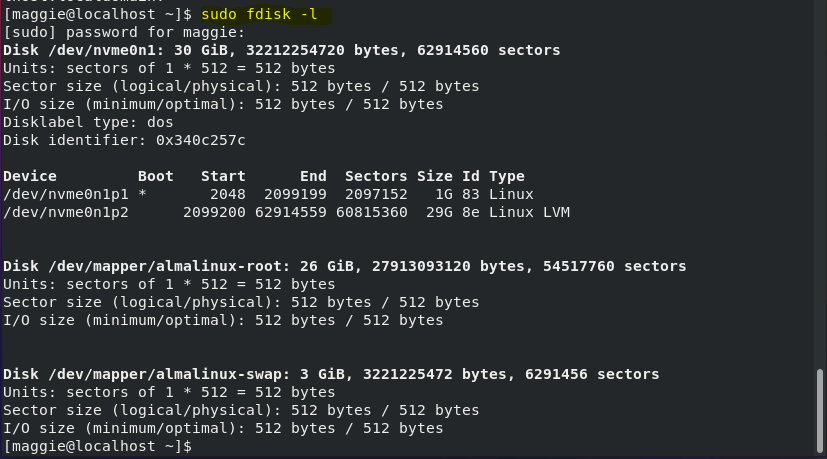

   ```
   exit
   ```

## Lab 2: Disabling the Sudo Timer

### Objective
Configure and disable the sudo password timeout (sudo timer) on AlmaLinux 9 to enhance security by requiring password entry for every sudo command, both globally and for specific users.

### Steps

1. **Add User to Sudo Group:**
   Add your user account to the wheel group to grant sudo access:
   ```
   usermod -aG wheel taptue
   ```
   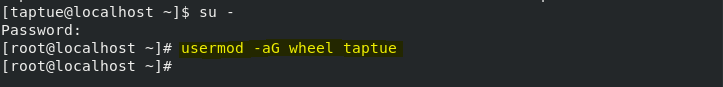

   Test sudo commands:
   ```
   sudo fdisk -l
   ```
   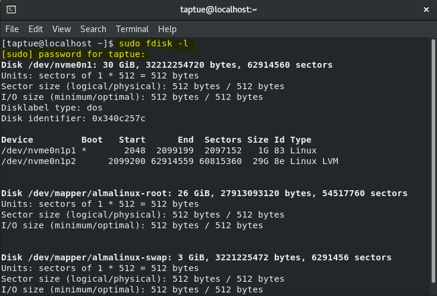

   ```
   sudo systemctl status sshd
   ```
   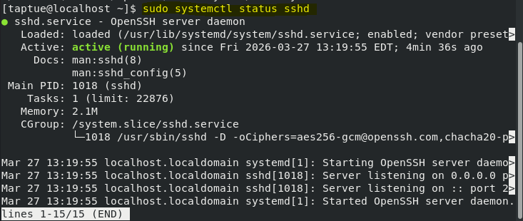

   ```
   sudo iptables -L
   ```
   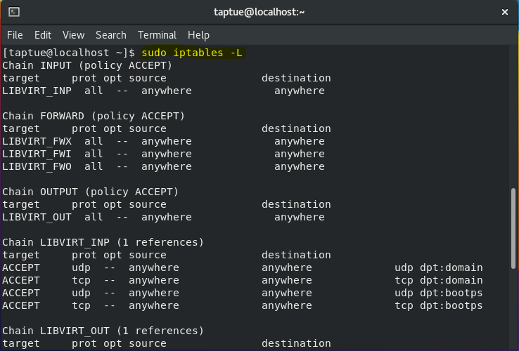

2. **Reset Sudo Timer:**
   Run a sudo command, then reset the timer:
   ```
   sudo fdisk -l
   ```
   

   ```
   sudo -k
   sudo fdisk -l
   ```
   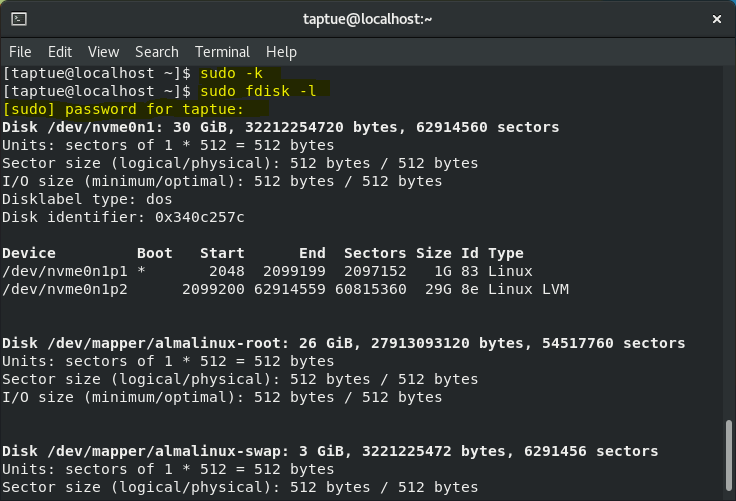

3. **Edit Sudoers File:**
   Open visudo and search for the Defaults section:
   ```
   sudo visudo
   ```
   (Use `/Defaults` to search within visudo.)
   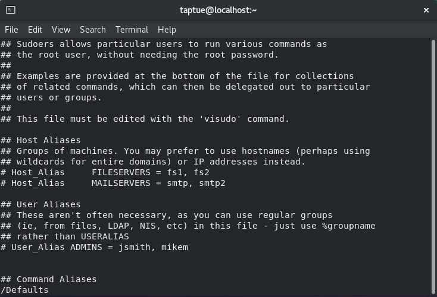

4. **Disable Global Sudo Timer:**
   In the Defaults section, add or modify the line:
   ```
   Defaults timestamp_timeout = 0
   ```
   Save the file and exit visudo.
   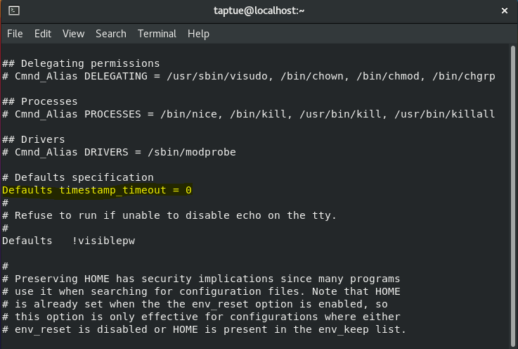

5. **Verify Global Timer Disable:**
   Test commands again; you should be prompted for a password each time:
   ```
   sudo fdisk -l
   ```
   

   ```
   sudo systemctl status sshd
   ```
   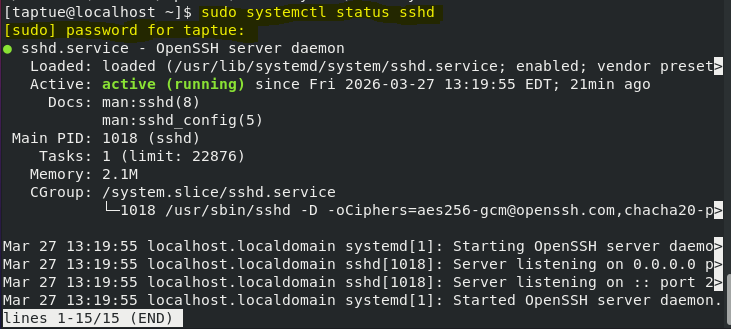

   ```
   sudo iptables -L
   ```
   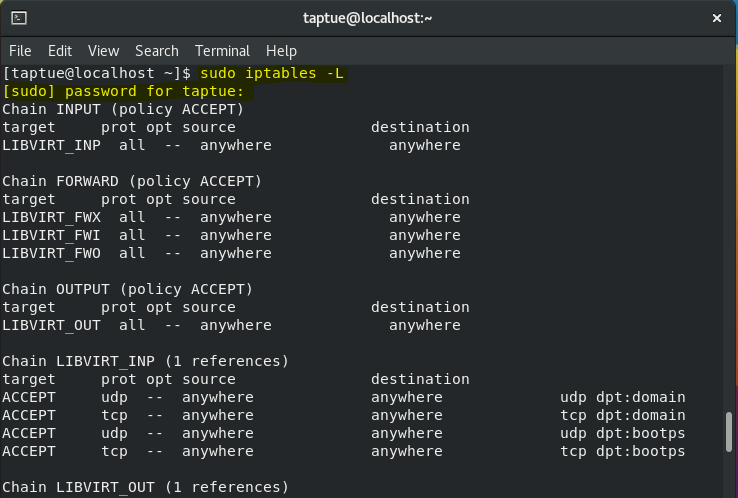

6. **Set Timeout for Specific User (Lionel):**
   Modify the Defaults line for Lionel:
   ```
   Defaults:lionel timestamp_timeout = 0
   ```
   Save and exit visudo.
   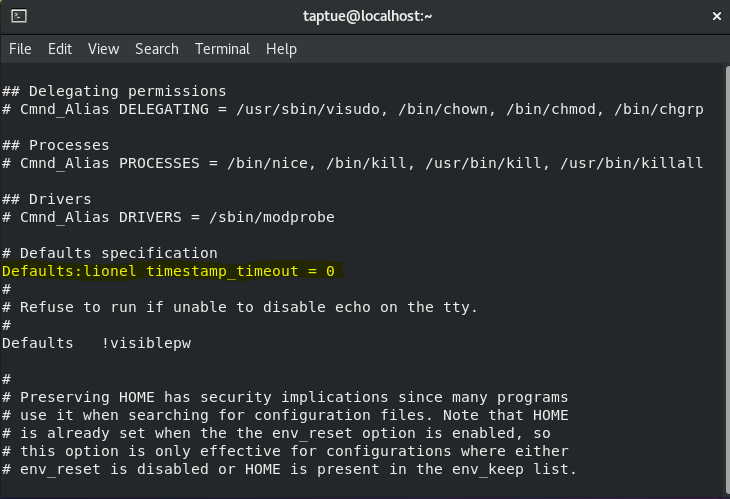

7. **Verify User-Specific Behavior:**
   - Run commands from your own account (taptue):
     ```
     sudo fdisk -l
     sudo systemctl status sshd
     sudo iptables -L
     ```
     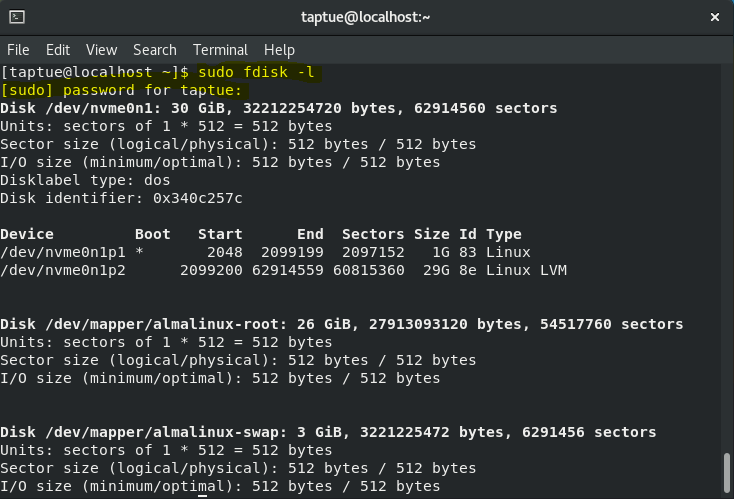
     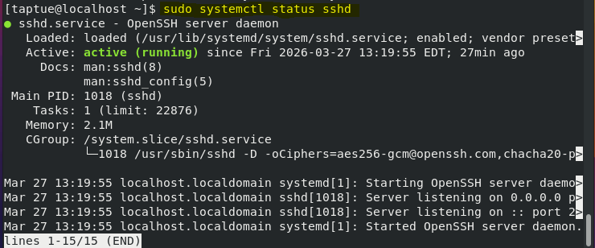
     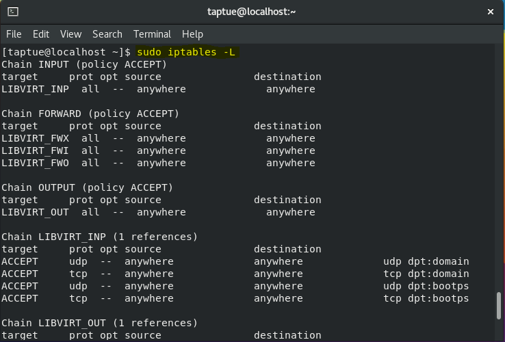

   - Switch to Lionel's account and run the same commands:
     ```
     su - lionel
     sudo fdisk -l
     sudo systemctl status sshd
     sudo iptables -L
     exit
     ```
     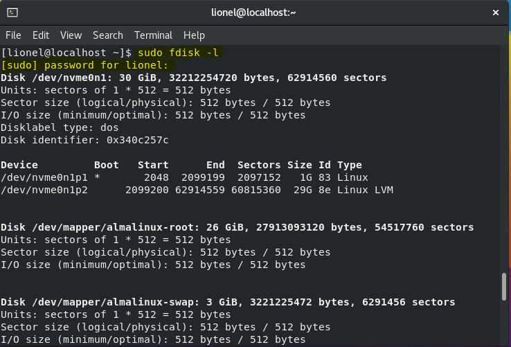
     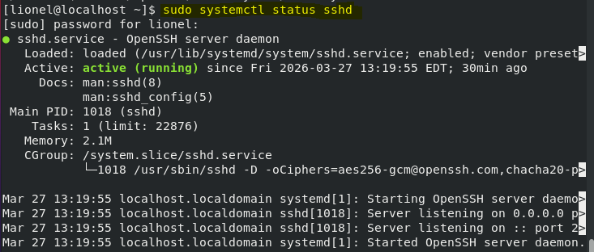
     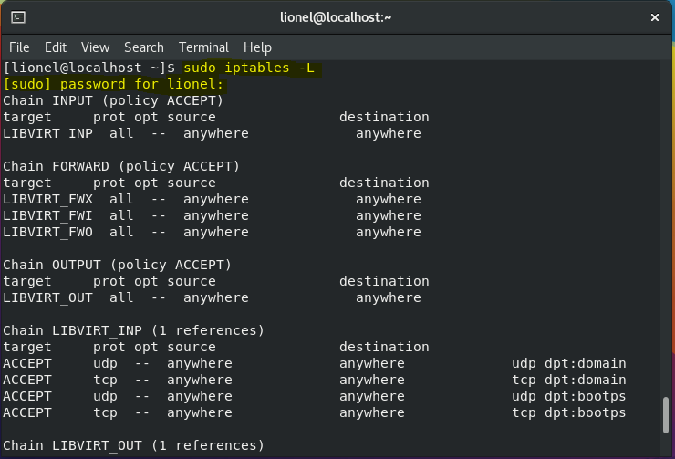

8. **Check Sudo Privileges:**
   View your sudo privileges:
   ```
   sudo -l
   ```
   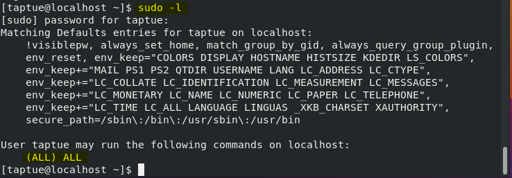

## Key Learnings
- Configuring granular sudo privileges enhances system security by limiting user access.
- Understanding sudoers file syntax and command aliases.
- Managing sudo timer for different security requirements, including global and per-user settings.
- Practical user account management and group assignments in Linux environments.
- Resetting sudo sessions and verifying privilege configurations.

## Technologies Used
- AlmaLinux 9
- Sudo configuration and visudo
- Systemctl for service management
- User management tools (useradd, passwd, usermod)
- Iptables for firewall management

This project demonstrates proficiency in Linux system administration, particularly in access control, security configuration, and user privilege management.

